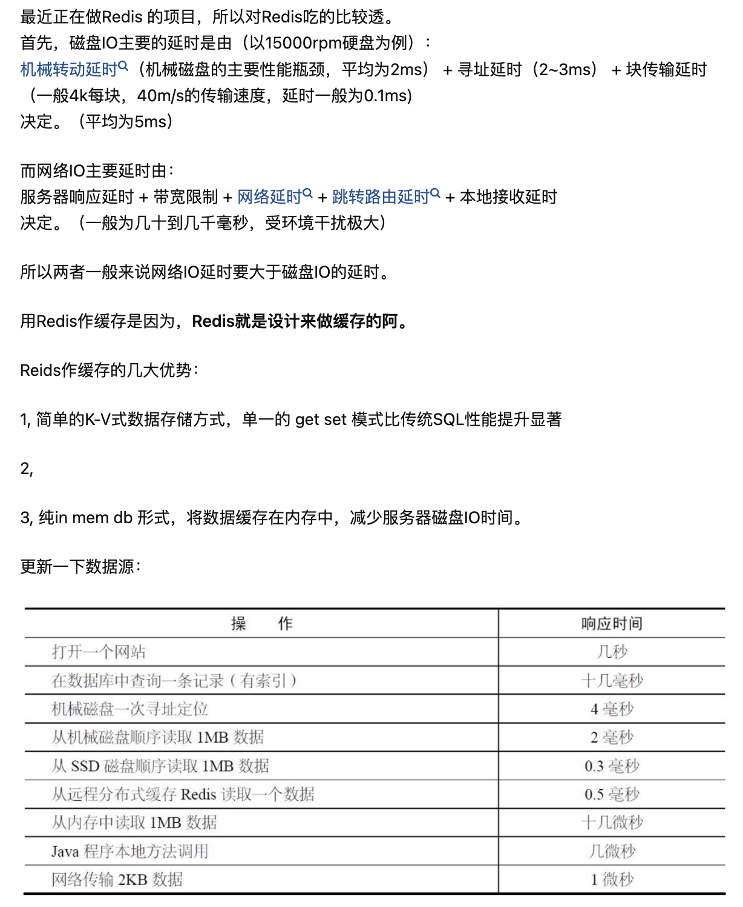
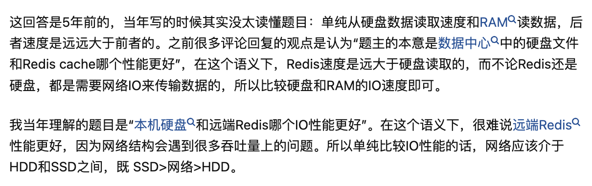
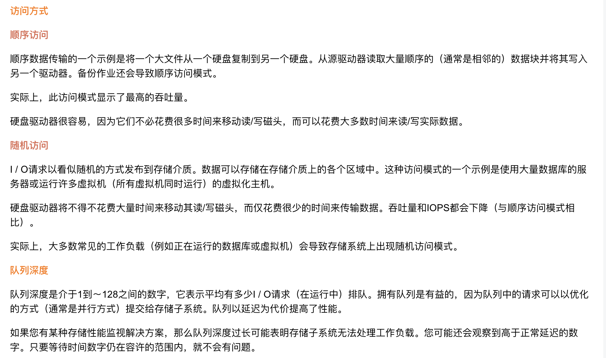
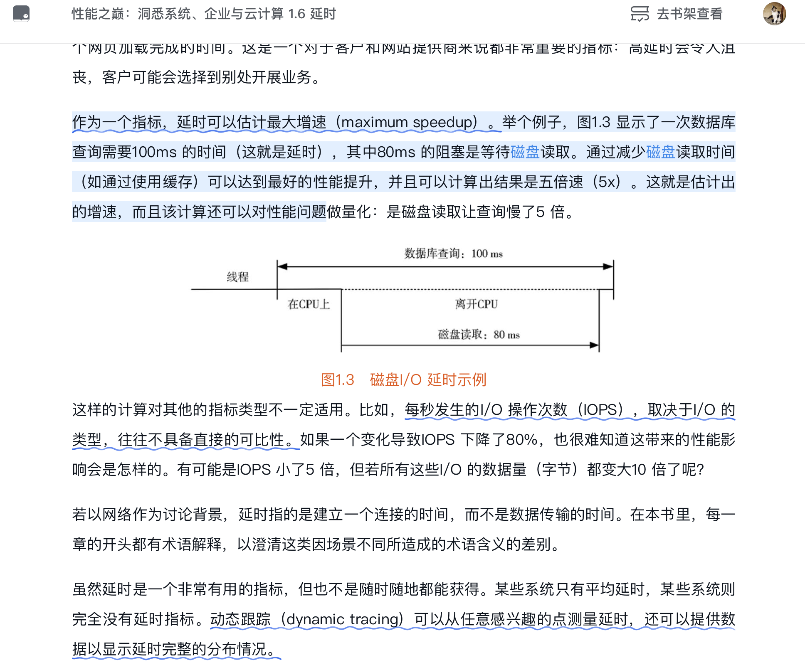
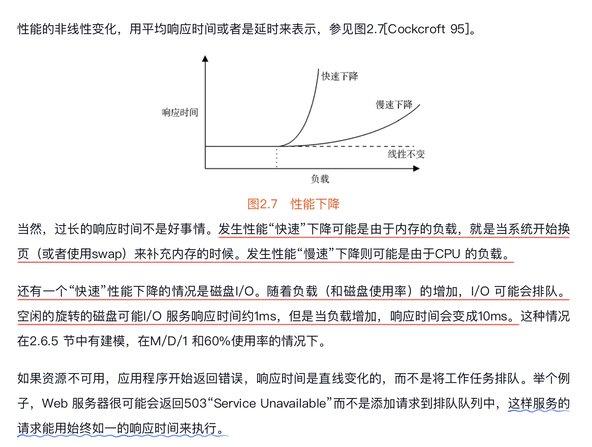
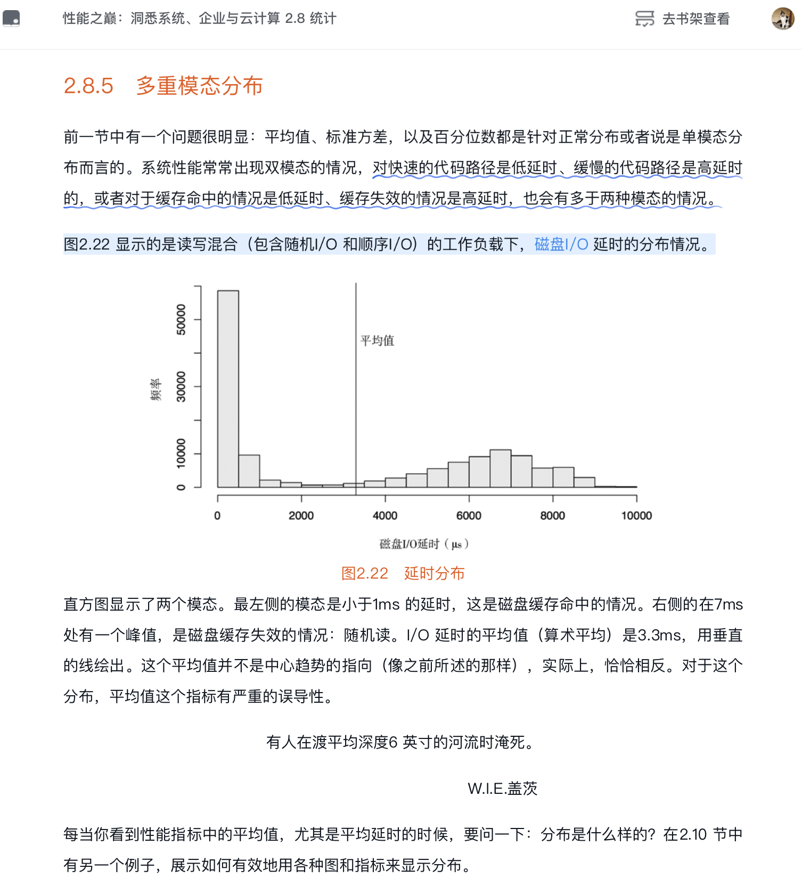
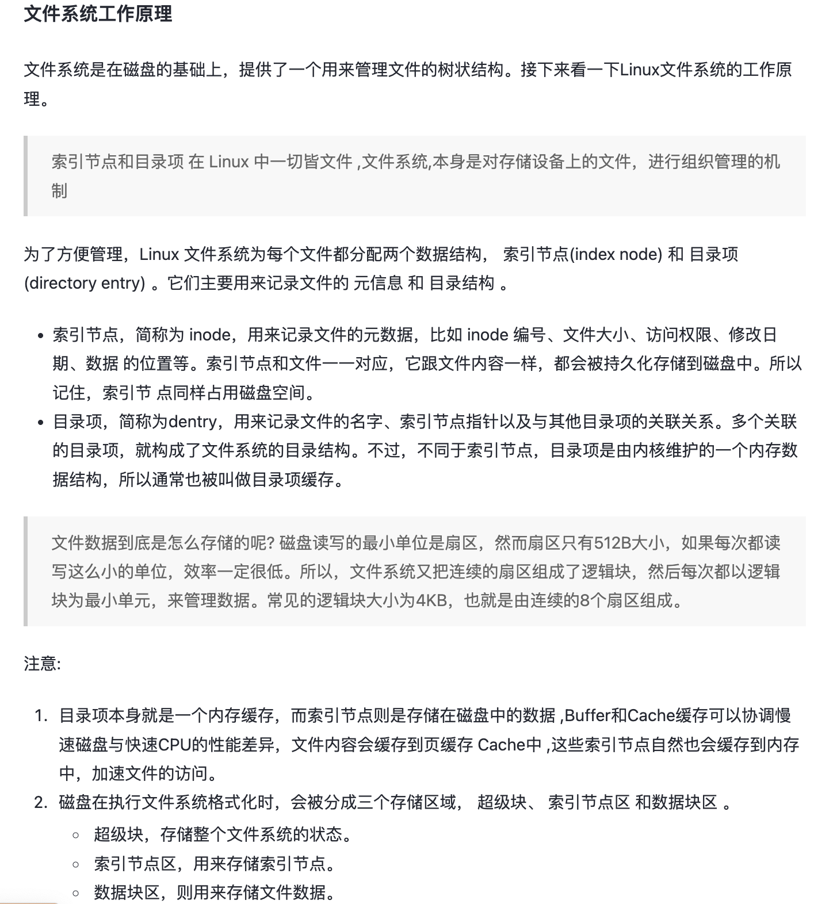
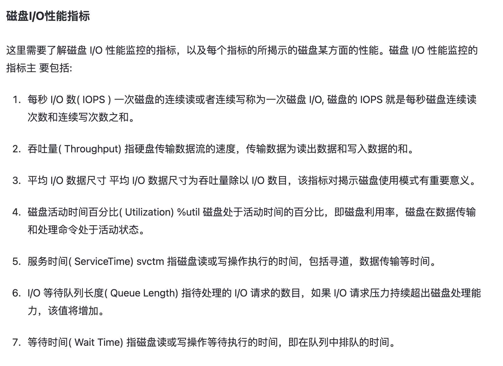
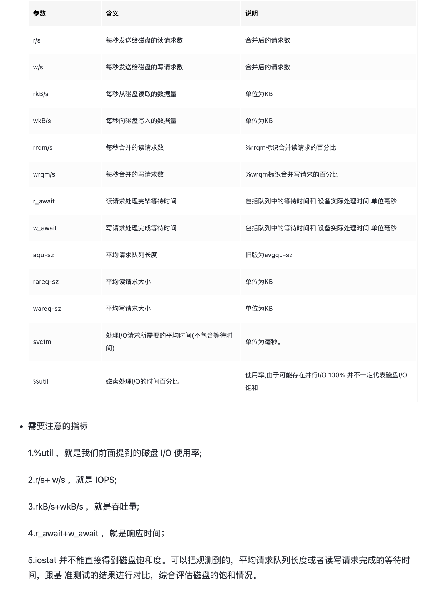

```yaml
title: 磁盘
date: 2023-05-19 19:07:00
tags: 
- 存储
- 磁盘
categories: 
- 学习
```

### acknowledge & 分析

- [性能案例分析 | 磁盘IO瓶颈分析 - 淡然~~浅笑 - 博客园 (cnblogs.com)](https://www.cnblogs.com/wyf0518/p/12213999.html)

- [了解存储性能-IOPS和延迟_硬盘延迟多少正常_allway2的博客-CSDN博客](https://blog.csdn.net/allway2/article/details/108371452)

### 磁盘IO和网络IO

[网络 IO 比磁盘 IO 效率快吗？ - 知乎用户的回答 - 知乎](https://www.zhihu.com/question/47589908/answer/109590861)

> 
> 
> 

### 访问模式



### 最大增速

- [性能之巅：定位和优化程序CPU、内存、IO瓶颈 - 知乎 (zhihu.com)](https://zhuanlan.zhihu.com/p/335091866)

> 
> 
> 

### 磁盘I/O 延时分布

> 

### 文件系统

- [性能优化-磁盘I/O篇 - 掘金 (juejin.cn)](https://juejin.cn/post/7031043765192097822)

> 

### 磁盘I/O性能指标

磁盘I/O中的各种性能指标和排查方法

- [磁盘IO过高，如何定位有问题的进程 - 知乎 (zhihu.com)](https://zhuanlan.zhihu.com/p/354809310)

- [Linux【IO】4. 为什么我的磁盘I/O延迟很高？_磁盘io读写延迟_ghostwritten的博客-CSDN博客](https://blog.csdn.net/xixihahalelehehe/article/details/118702233)

- [硬盘IO性能估算(IOPS,吞吐量，延时)_7200磁盘iops计算_eustance的博客-CSDN博客](https://blog.csdn.net/eustance/article/details/108455088)

> 
> 
> 

## from chatGPT

在缓存系统中，磁盘I/O压力对读取延迟的影响是一个重要的问题。当写入次数过多时，磁盘的I/O负载增加，可能导致I/O请求在排队中等待处理，从而增加了读取操作的延迟。

要解决这个问题，可以考虑以下几个方面：

> - 硬件升级：升级到更高速度或更高容量的硬盘驱动器，例如使用固态硬盘（SSD）代替传统的机械硬盘。SSD通常具有更低的读取延迟和更高的I/O吞吐量。
> 
> - 缓存优化：通过实现适当的缓存策略，可以减少对磁盘的直接读取操作。缓存可以将经常访问的数据存储在更快的存储介质（如内存）中，从而提高读取性能。
> 
> - 并行处理：将I/O请求分发到多个磁盘驱动器上进行并行处理，以减少排队和延迟。这可以通过使用RAID（磁盘阵列）等技术来实现。
> 
> - 负载均衡：通过将负载均衡技术应用于存储系统，可以在多个磁盘之间平衡请求，从而减轻单个磁盘的负载，降低读取延迟。

## 其他

[缓存与TLB不命中时延及相关参数测量 - 知乎 (zhihu.com)](https://zhuanlan.zhihu.com/p/117563280)

## TODOList

- 文件系统层面的优化

- 如果某资源，在磁盘上的io量过高，可以考虑在其它盘对该资源进行备份。

- 有没有可能，并不需要调度层面的优化，而是直接用工程的方式去解决。

- 因为需要考虑冷热的问题，如果实在很冷那么也不会具有过高的IO
