# CACHEUS

[Learning Cache Replacement with CACHEUS | USENIX](https://www.usenix.org/conference/fast21/presentation/rodriguez)

[fast21_slides_yusuf.pdf (usenix.org)](https://www.usenix.org/sites/default/files/conference/protected-files/fast21_slides_yusuf.pdf)

[FAST21'《Learning Cache Replacement with CACHEUS》论文阅读笔记 | PancrasL的博客 (gitee.io)](https://pancrasl.gitee.io/2021/03/29/Learning-Cache-Replacement-with-CACHEUS/)

## 2Q算法

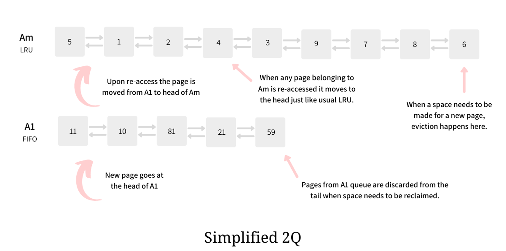

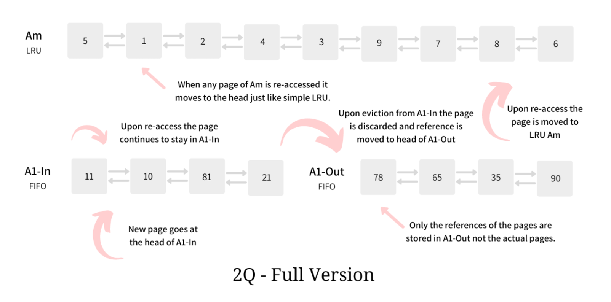

2Q：核心思想类似LRU-2，由一个fifo（A1）和一个lru_list（Am）组成，降低了实现LRU-2的时间复杂度。

发现了一种常见的workload：一个新的page被加载到缓存后，短时间内会被多次访问，但过了一段时间有可能不会再被访问也有可能被继续访问，**若是被继续访问，说明这是个值得长期保存的page**。

所以把fifo划分成了A1in和A1out，A1in存放首次访问的page，A1out保留从A1in中淘汰的page的索引。若一个新pageA首次加载被放入A1in中时，由于在短时间内会被多次访问，所以即使在fifo队列中，也不会那么容易被淘汰。若一段时间后，pageA被淘汰了，索引保存在A1out的索引中，然后又过了一段时间，发现pageA再次被访问，则说明该page是个会被长期访问的page，就会把pageA加载到Am上，后续访问pageA能在Am直接命中，且将其移至Am头部，确保不易被淘汰。

•优点：降低了LRU-2的实现复杂度。

•缺点：还是需要调参，有两个参数Kin和Kout。Kin表示A1in的大小，有点像CIP；Kout表示A1out的大小。

>A1in中的页被命中既不会被提前也不会被promote到Am中，promote会推迟到页被淘汰出缓存，进入A1out才发生，这才是full version的核心，可是这样的目的是啥呢？
>文中对于完整版相较于简化版本的优化是这样解释的：如果有一种访问模式，其中某一些页在一段时间内被频繁地访问，但是接下来就不再被访问，那么这样的页应当被及时的从缓存中移走，而不是进入Am；也就是说作者主张，简化版本之所以效果不好，是因为它无法很好地处理上述访问模式，而修改之后的完整版可以，那么这样的解释是合理的吗？
>————————————————
>版权声明：本文为CSDN博主「Kartano」的原创文章，遵循CC 4.0 BY-SA版权协议，转载请附上原文出处链接及本声明。
>原文链接：https://blog.csdn.net/Sableye/article/details/118703319

## Multi-Queue(MQ)

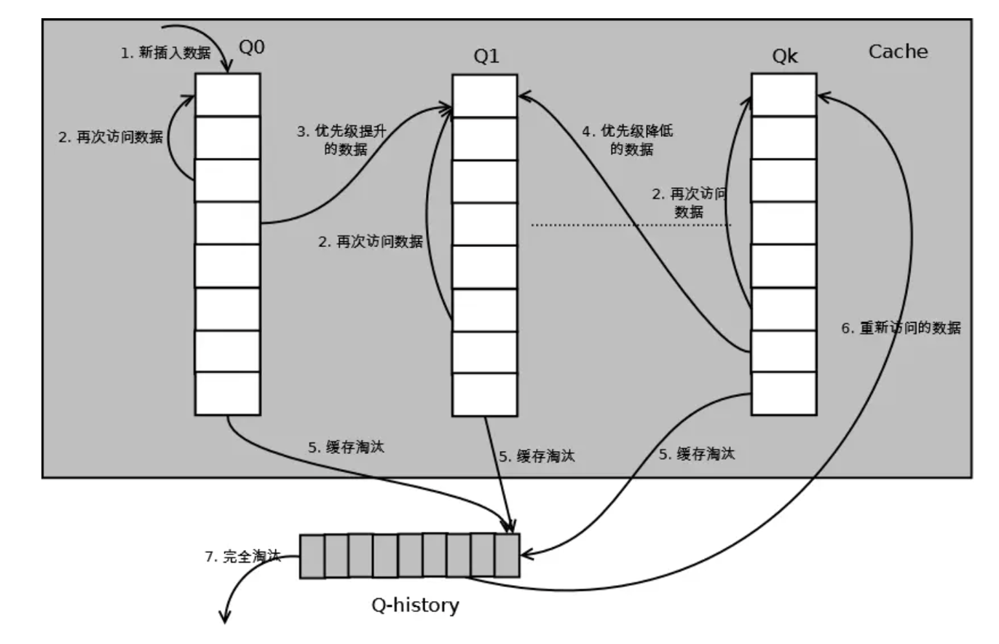

**Minimal Lifetime**

- 对于一个给定的负载，缓存中的热数据块应该保持最少minDist时间
- 变量minDist是对多种实际环境下的负载进行统计后得出的结论，它描述进入二级缓存的数据块在缓存中应该驻留的最小时间量。

**Frequency-based priority**

- 数据块的优先级应该基于它们的访问频率

**Temporal frequency**

- 过去访问频繁但现在很少被访问的数据块应该被替换掉

MQ采用多级队列，每个队列保存被访问了一定次数的数据块

- MQ算法使用多个LRU队列:Q0,Q1......,Qm-1。位于Qj中的缓存块拥有比Qi中缓存块更长的生存时间(j>i)
- MQ还有一个历史队列Qout，它是一个有限长的FIFO队列，用来记录从LRU队列中淘汰的缓存块

- 当cache命中时，则该数据块的访问频率f+1，并且根据QueueNum(f)确定它所在的序列，通常QueueNum定义为log2(f)。
- 每次访问都会看队尾的数据块是否过期，如果过期，则移动到下一级队列。
  - 生命周期由 MQ 算法动态定义为对同一文件的两次访问之间的最大时间距离或缓存块的数量
- 如果对数据块的访问没有命中，则从优先级最低的非空队列中淘汰掉队首元素，当队首元素被淘汰掉时，它的标志符和当前的访问频率将插入Qout队列队尾。
  - 如果Qout队列已满，则依据FIFO算法淘汰掉Qout队列中最老的也就是队首元素。

## ARC算法

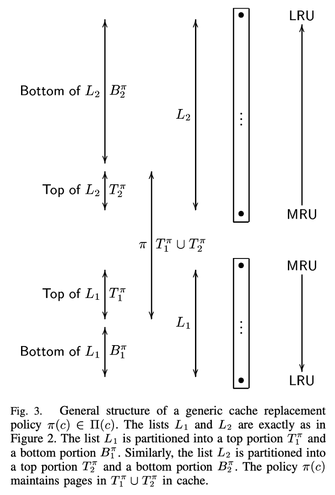

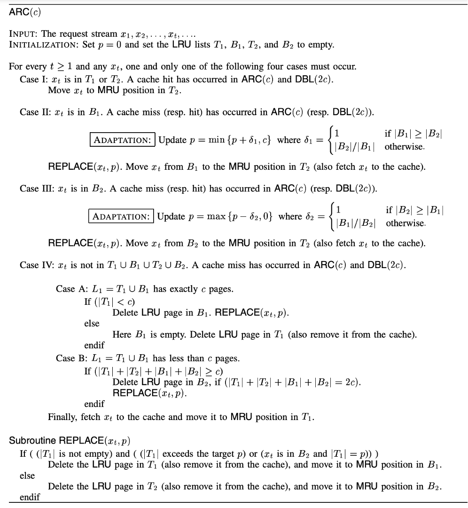

动态调整的思路：

- 访问B1时，说明当前的窗口p较小，将p增大
- 访问B2时，说明倾向于访问有频度的数据，将p减小

## LIRS

**Low Inter-reference Recency Set(LIRS)**

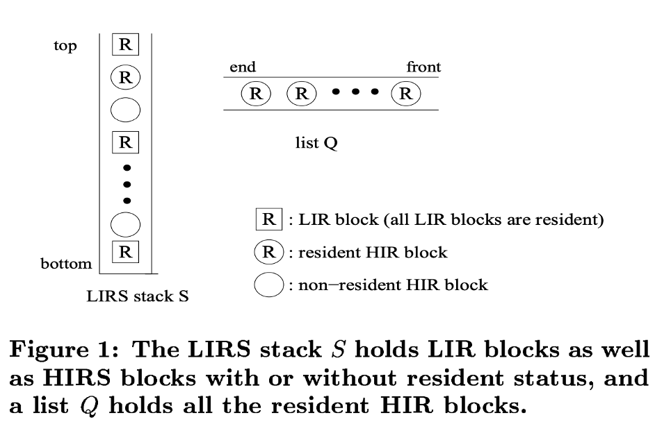

**IRR(Inter-Reference Recency):** 最近连续两次块访问之间访问其他块的个数。

- IRR 可以衡量数据当前访问的频度。
- IRR 越高说明在某个时间区间中，该数据的热度较低
- 根据高低区分了 LIR(Low IRR Block) 和 HIR(High IRR Block)
- LIR: 低 IRR, 热数据，全都写在缓存中
- HIR: 高 IRR, 冷数据，不一定写在缓存中。驻留在缓存中的部分称为resident-HIR，否则称为nonresident-HIR.

**R(Recency):** 最近一次访问到当前时间内访问其他块的个数，即 LRU 的维护的数据。

- ==核心假设: **认为** **IRR** **大的数据，那么下一次的** **IRR** **会更大**==

算法：

- 当S中的HIR被命中：
  - HIR转换为LIR，并且移动到S栈顶
  - 并且，S栈底的LIR变成一个HIR，并且被移动到Q栈顶。

- 当S中的LIR被命中：
  - 该LIR移动到S栈顶。
  - 如果S的栈底不是LIR，则进行Stack Tuning，驱逐栈底的HIR，直到栈底是LIR。
    - 要对比 IRR 值其实可以通过对比 R 值来实现，如果一个 HIR 块的 R 值小于某个 LIR 块的 R 值，那么当这个 HIR 块被命中时，其 IRR 值肯定小于这个 LIR 块的下一个 IRR 值，所以剔除 LIR 时简单的比较 R 值就行。

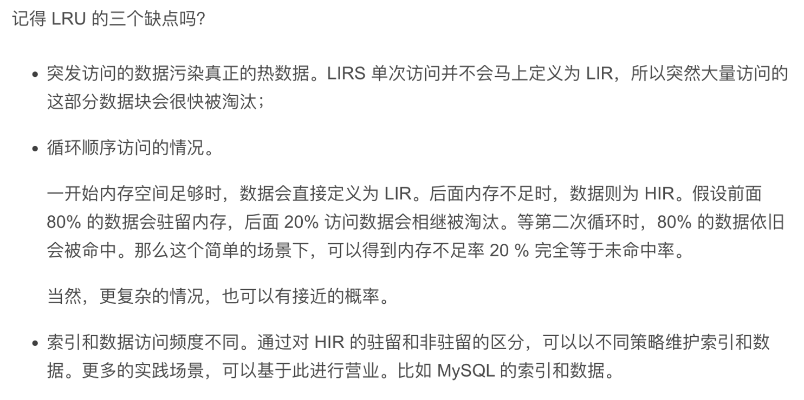

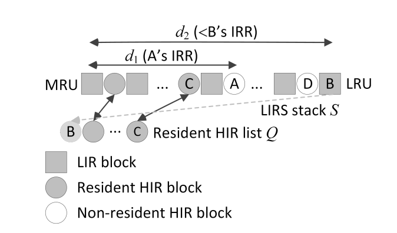

## DLIRS算法

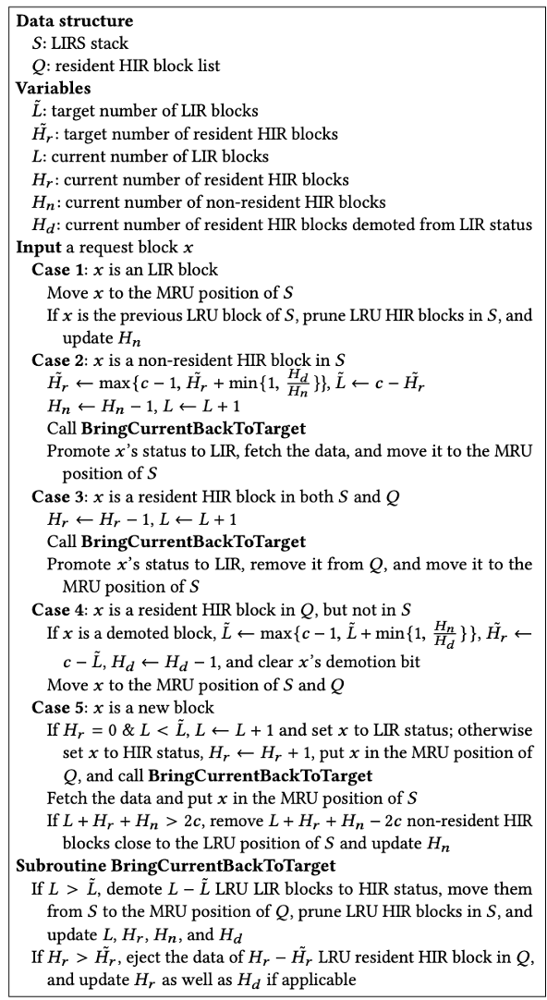

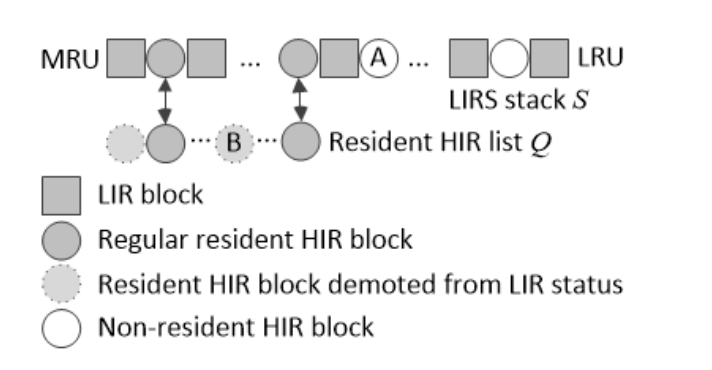

调整的思路：

- 如果请求数据属于non-resident HIR block，应该为resident HIR提供更多空间。
- 如果请求数据为demoted block，说明分配给LIR的空间较小，导致了不适当的降级，应该为LIR提供更多空间。

> 由于在对LRU友好的工作负载下，LIRS的性能受到非驻留HIR块相对接近LIRS堆栈的MRU位置的影响，所以自然要为HIR块分配更多的缓存空间，以便这些非驻留块成为驻留块。
>
> 然而，这是以减少LIR块条目的数量为代价的，限制了LIRS堆栈的长度，从而减少了跟踪的非驻留HIR块的数量，这最终会降低在其他工作负载中捕捉长时间距离的重复访问的能力。
>
> 
>
> 
>
> 动态LIRS（DLIRS），这是一个新的政策，它动态地将缓存空间分配给LIR块，而不是HIR块，以适应不同类型的工作负载。

## CACHEUS

### Workload

- LRU-Friendly
- LFU-Friendly
- Scan：顺序访问存储数据中的一个子集，子集中的每个元素只访问一次
- Churn：同样是不断访问存储数据中的一个子集，不过每次随机访问子集中的任一数据，所有数据都有相同的概率被访问。

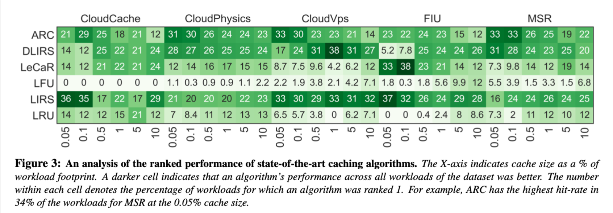

### 算法

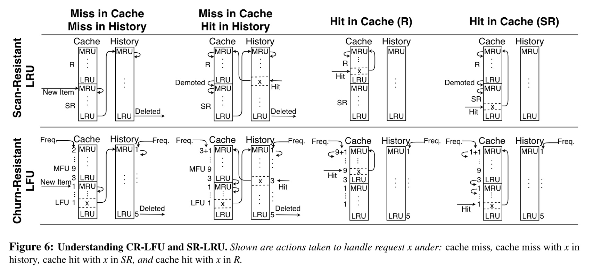

SF-LRU和2Q有什么区别？

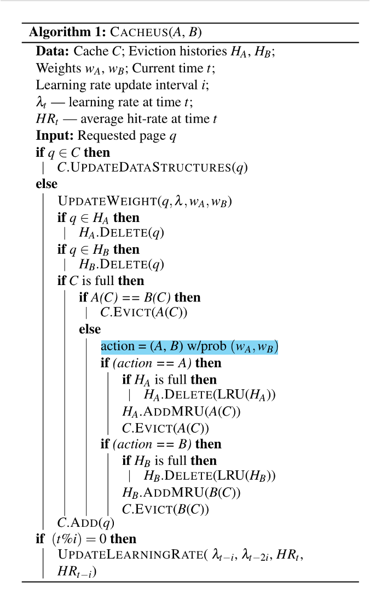

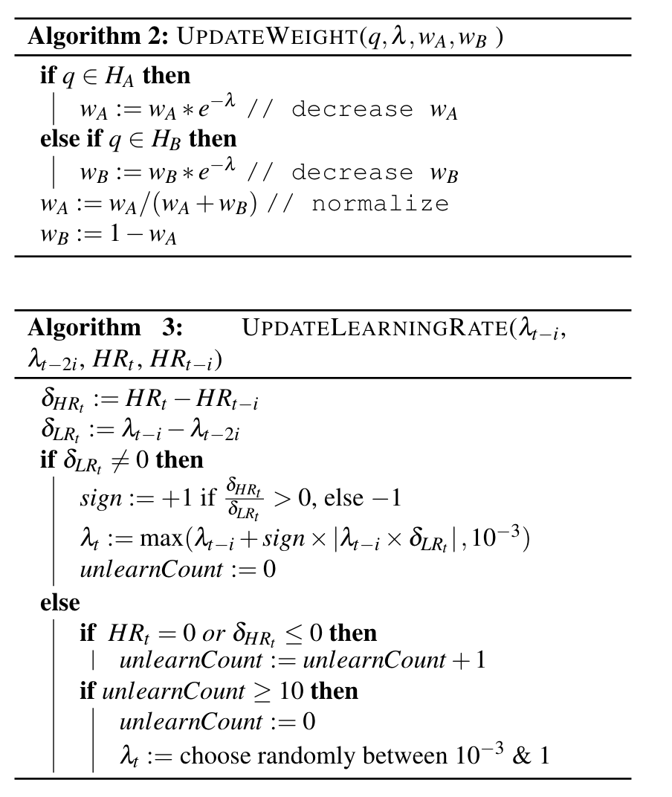

### SR-LRU

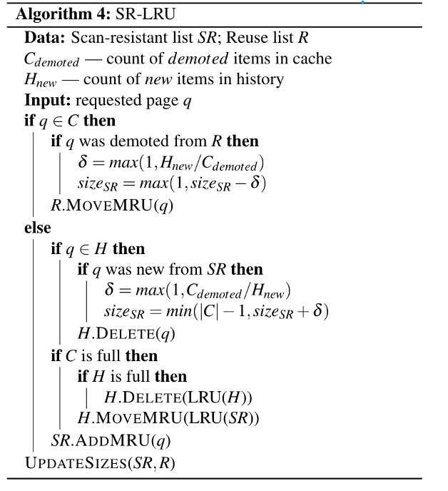

## Links

- [FAST21'《Learning Cache Replacement with CACHEUS》论文阅读笔记 | PancrasL的博客 (gitee.io)](https://pancrasl.gitee.io/2021/03/29/Learning-Cache-Replacement-with-CACHEUS/)

- [基于强化学习的存储优化研究 - Emperorlu’s Site](https://emperorlu.github.io/replica-placement-with-RL/)

