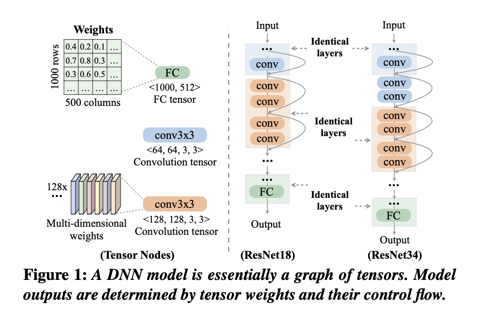
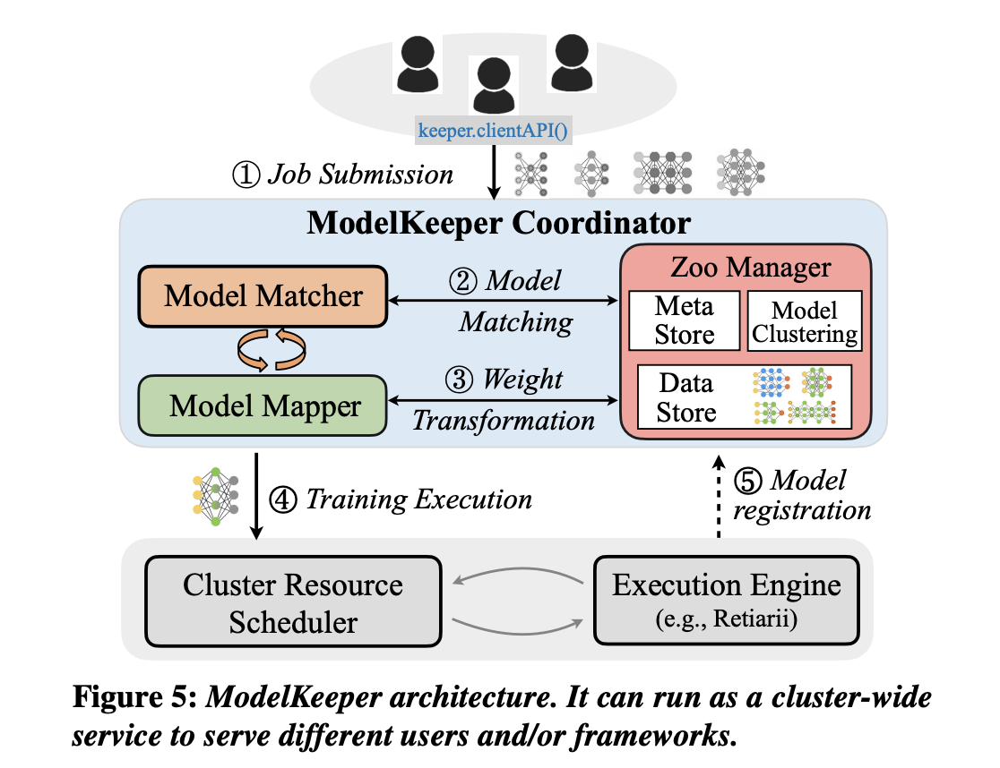
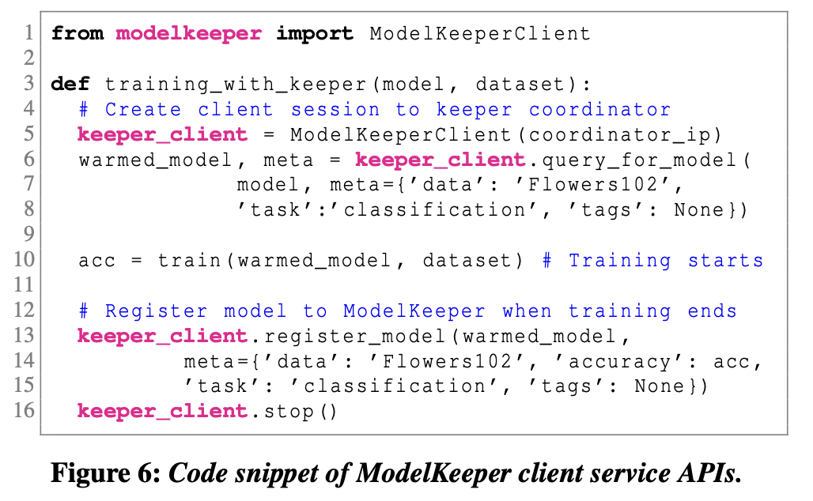
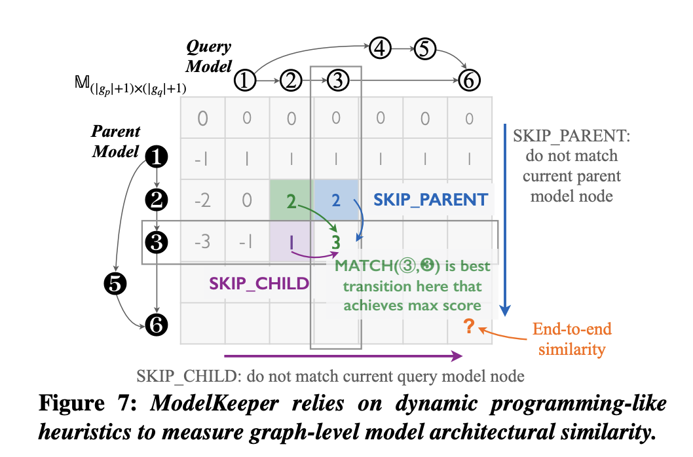
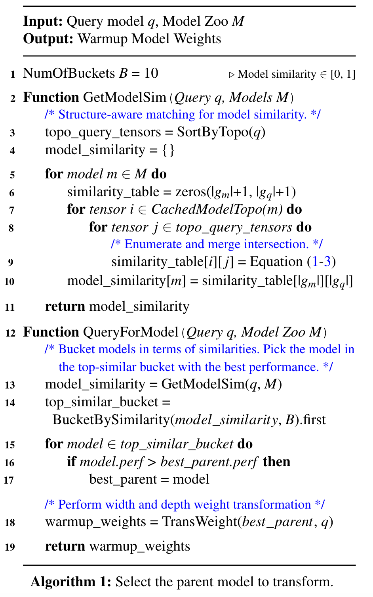
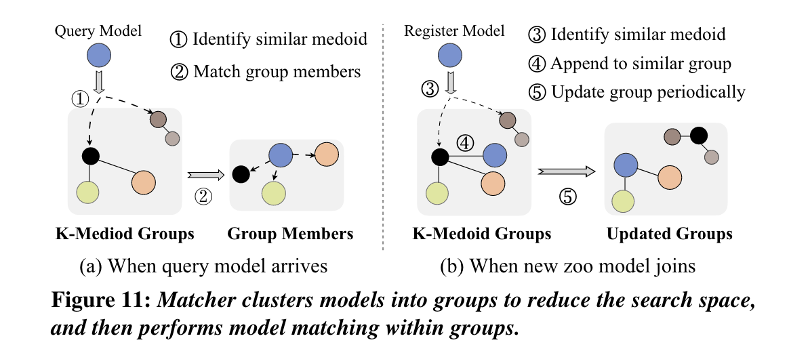

## 动机

随着机器学习（ML）模型的部署越来越多，ML开发人员正在训练或重新训练越来越多的深度神经网络（DNN）。他们这样做是为了找到最合适的模型，以满足他们的精度要求，同时满足目标环境的资源和及时性限制。

In large shared clusters, the growing number of neural architecture search (NAS) and training jobs often result in ==models sharing architectural similarities with others from the same or a different ML developer==. However, existing solutions do not provide a systematic mechanism to identify and leverage such similarities.

在大型共享集群中，越来越多的神经架构搜索（NAS）和训练工作往往导致模型与来自同一或不同的ML开发者的其他模型共享架构相似性。然而，现有的解决方案并没有提供一个系统的机制来识别和利用这种相似性。

## 模型

我们提出了ModelKeeper，这是第一个自动训练预热系统（the first automated training warmup system），**通过在共享集群中重新利用以前训练的模型来加速DNN训练**。

### main idea

我们的主要观点是，通过转换已经训练过的模型的权重来初始化训练工作的模型，可以快速启动它并减少所需的总训练量。然而，随着时间的推移，提交的模型在架构和准确度上会有所不同。

“In this paper, our key insight is that one can reduce the amount of training needed for model convergence by leveraging a well-trained model’s weights to warm up the training of a new model.” 

🔤可以通过利用训练有素的模型的权重来预热新模型的训练，从而减少模型收敛所需的训练量。🔤

给定一个要训练的新模型，ModelKeeper可扩展地识别其与先前训练的模型的架构相似性，选择一个具有高相似性和良好模型精度的父模型，并执行结构感知的权重转换，以在新模型权重的预热期间保留来自父模型的最大信息。

### ModelKeeper 架构

## 评估

我们对数以千计的CV和NLP模型的评估表明，ModelKeeper实现了1.3×-4.3×的训练完成速度，而且开销不大，模型精度也没有降低。