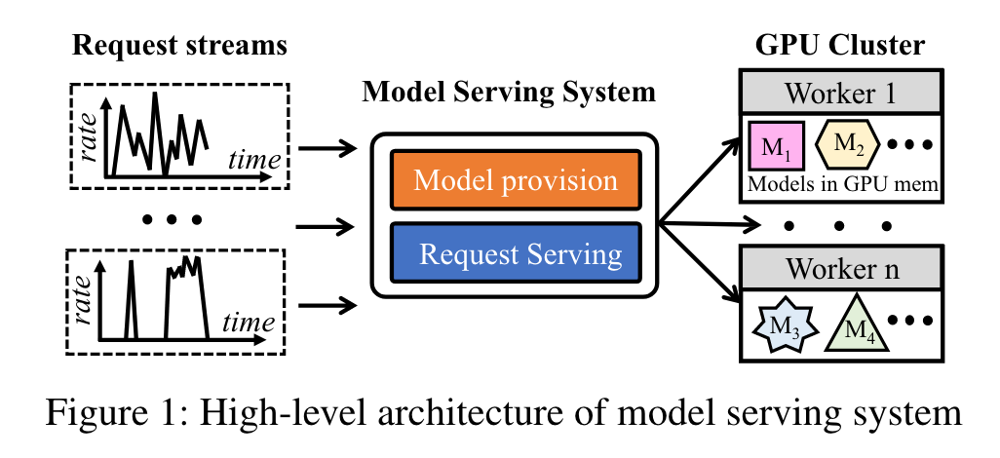
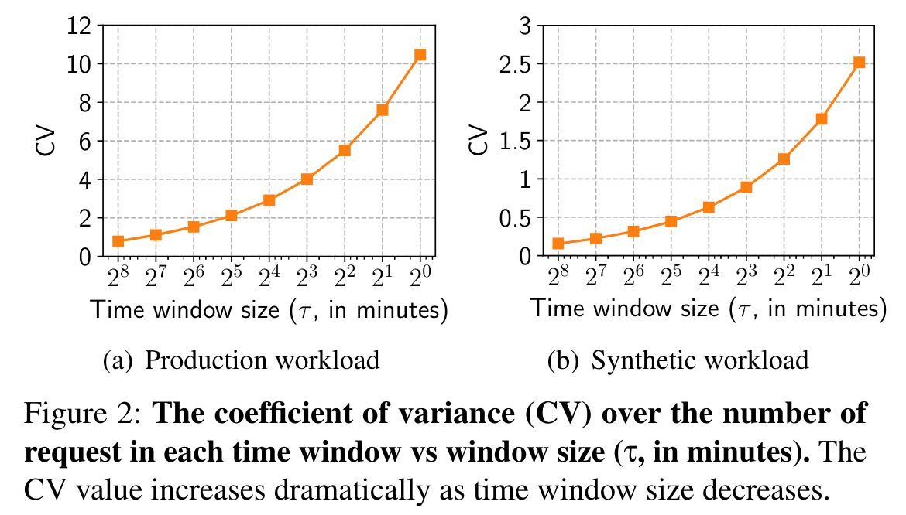
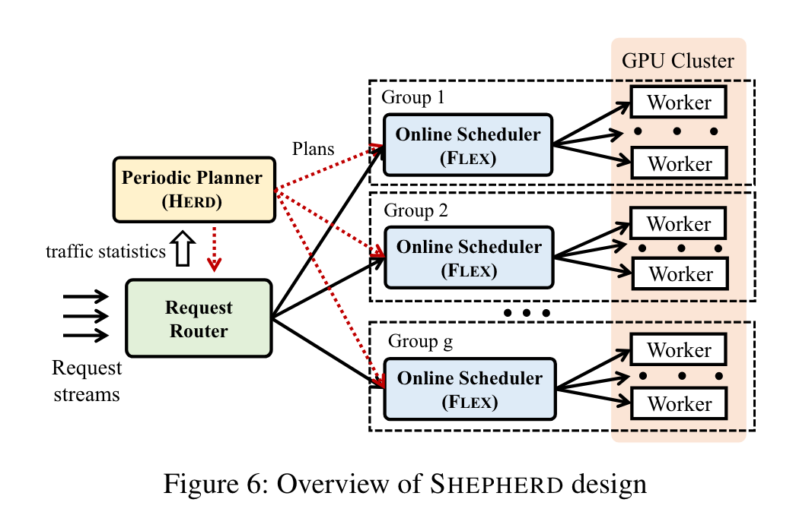
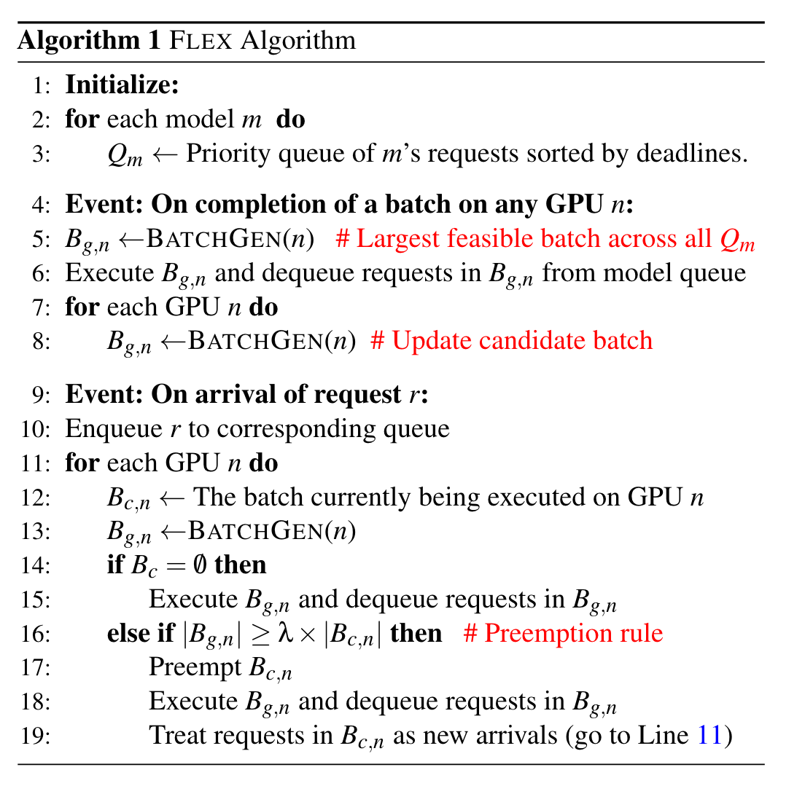

## Abstract

**模型服务系统 (Model serving systems)** 需要满足的特性：

These systems need to be scalable, guarantee high system goodput and maximize resource utilization across compute units

- 可扩展 (scalable)
- 高系统吞吐量 (high system goodput)
- 最大限度地提高计算单元的资源利用率 (resource utilization)

## 挑战

推理请求具有非常严格的延迟限制（10-500 毫秒），并且生产工作负载在如此小的时间粒度上可能极其不可预测。

### Unpredictability

**short-term workload unpredictability**

>请求到达模式的不可预测性与先前的工作中展示的性能可预测性是正交的，在这些工作中，推理请求在GPU上的执行延迟通常是可预测的。

平均请求到达率在较长时间范围内 (e.g. Hours) 是可以预测的.

在较小的时间颗粒度（如毫秒），它们大概率是不可预测的，必须考虑满足每个请求的SLO截止日期.

虽然单个请求流 (request stream) 可能是高度不可预测的，但将请求流聚合到中等大小的组 **(moderately-sized group)** 中可以大大提高可预测性，从而实现高资源利用率和可扩展性。

## SHEPHERD Design

SHEPHERD是一个模型服务系统，它在**工作负载不可预测的情况下**实现了三个目标：scalable,high system goodput, resource utilization.

SHEPHERD employs a novel online algorithm that provides guaranteed goodput under workload unpredictability by carefully leveraging preemptions and modelspecific batching properties.

SHEPHERD 采用一种新颖的在线算法，通过仔细利用**抢占**和**模型特定的批处理属性**，在工作负载不可预测的情况下提供有保证的吞吐量。

### 整体设计

SHEPHERD 使用两级设计，将模型服务 (model serving) 解耦为**规划 (planning) 和服务 (serving) 模块**。

### 在线调度器：FLEX算法

