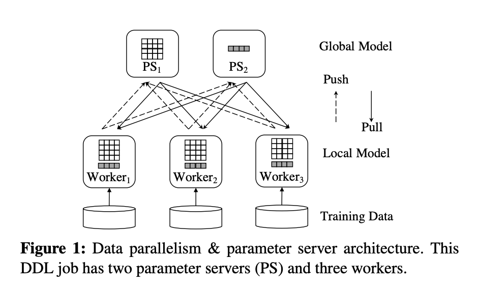

## Tiresias: A GPU Cluster Manager for Distributed Deep Learning

### abstract

NSDI'2019

这篇论文介绍了 Tiresias，一个为分布式深度学习定制的 GPU 集群管理器，它能有效地调度和放置 DL 作业以减少其作业完成时间（JCT）。

鉴于 DL 作业的执行时间通常是不可预测的，作者提出了两种调度算法 

- Discretized Two-Dimensional Gittins index
- Discretized Two-Dimensional LAS 

旨在最小化平均 JCT。

此外，作者描述了何时可以放宽集中放置约束，并提出了一种放置算法来利用这些观察结果而无需任何用户输入。
实验结果表明，与生产中使用的基于 Apache YARN 的资源管理器相比，Tiresias 可将平均 JCT 提高多达 5.5 倍。
更重要的是，Tiresias 的性能与假设完美知识的解决方案相当。

### Over-Aggressive Job Consolidation指的是什么

在这篇论文中，Over-Aggressive Job Consolidation 指的是现有集群管理器在放置 DDL 作业时过于激进地尝试将作业合并到最少数量的服务器上。

例如，一个需要 16 个 GPU 的作业在一个每台服务器拥有 4 个 GPU 的集群中至少需要四台服务器，如果找不到四台完全空闲的服务器，该作业可能会被阻塞。

这种做法的基础假设是应尽可能避免使用网络，因为它可能成为瓶颈并浪费 GPU 周期。然而，作者发现这种假设只是部分正确的。

论文中提出了一种新的解决方案，即使用模型结构来在可能的情况下放宽集中放置约束。

作者观察到，只有某些类型的 DL 模型对它们是否被合并敏感，而它们的敏感性是由于模型中张量大小分布的不均匀性造成的。

作者利用这一见解将作业分为两类：对合并敏感的作业（高偏斜）和其他作业。

Tiresias 实现了一个 RDMA 网络分析库，可以通过网络级活动确定 DDL 作业的模型结构。通过利用分析库和 DDL 训练的迭代性质，Tiresias 可以透明且智能地放置作业。
Tiresias 首先在试验环境中运行作业几次迭代，然后根据先前测量总结出的标准确定最佳放置策略。

### Attained Service指的是什么

Attained Service：作业已经获得的服务量。

它是根据作业使用的 GPU 数量（WJ）和作业到目前为止运行的时间（tJ）计算得出的。前者在作业到达时就已知，而后者会不断增加。

2DAS 调度器使用 Attained Service 来为每个作业分配优先级。

每个作业的 Attained Service 基于它使用的 GPU 数量和到目前为止运行的时间计算。

2DAS 可以根据不同的先验知识更改优先级函数。如果没有提供作业持续时间信息，则优先级函数应用 LAS 算法，其中作业的优先级与其 Attained Service 成反比。

如果集群运营商提供了来自以前经验的作业持续时间分布，则作业的优先级等于其 Gittins 指数值。

<!--more-->