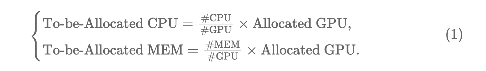
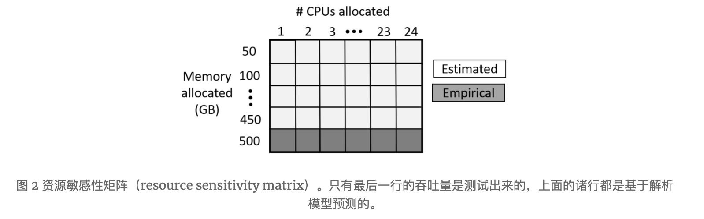

```yaml
title: "Synergy: Looking Beyond GPUs for DNN Scheduling on Multi-Tenant Clusters"
date: 2023-06-01 16:22:00
tags: 
- MLSys
- 深度学习调度
categories:
- 科研
- 论文
```

## **Looking Beyond GPUs for DNN Scheduling on Multi-Tenant Clusters**

> Jayashree Mohan, Amar Phanishayee, and Janardhan Kulkarni,*Microsoft Research;*Vijay Chidambaram,*University of Texas at Austin and VMware Research*

以下主要摘抄自[IPADS的论文评述](https://zhuanlan.zhihu.com/p/541704684)以及[Hailiang Zhao的文章](https://hliangzhao.cn/articles/000001660896665118db6926f214a2cab4f42f1ebdd563f000)

TODO：https://zhuanlan.zhihu.com/p/555568581

这篇文章来自Microsoft Research。

**是什么？**

一种面向多租户集群的DNN任务调度器，针对**DNN训练任务**。

**做了什么？**

在传统调度器的基础上，**将任务对CPU及内存资源分配的敏感度**纳入考虑，从而更好的分配和利用现有的集群资源，提高平均任务完成时间。

尽管 GPU 是 DNN 训练所需要的最主要的资源，但是 CPU 和 MEM 的分配策略同样也会显著影响到集群的资源利用效率和训练任务的吞吐量。 

由此，作者针对不同类型的 DNN，深入分析了 **CPU 和 MEM 的不同组合对其吞吐量的影响**，然后将最优的组合方案应用到了调度策略中。

### **背景**

近年来由于神经网络的广泛普及，DNN训练已经成为众多企业和云数据中心的一项主流工作负载。企业通常会设置大型多租户集群，配备GPU等硬件，来供多个用户和生产组共享。

除了一些特定于模型的参数与脚本外，一项训练任务在运行前还需要**人为指定其GPU需求**，而后将被交由集群的任务调度器进行调度和管理。

这些 DNN 任务调度器决定如何将 GPU 资源分配给多个任务，同时实施复杂的集群范围的调度策略以优化目标，例如平均任务完成时间 (JCT)，平均完成时间（average job completion time，JCT）、全体完工时间（makespan）和**用户级公平性**。

### **问题**

现有集群使用的任务调度器主要分为两类，一类是传统的大数据调度器，例如 Kubernetes 或 YARN；另一类是新式调度器，能够利用 DNN 任务特征以获得更好的性能和利用率。

这两种调度器都存在一个问题，即它们都假定**GPU是调度任务中占据主导地位的资源（dominant resources）**，而CPU、内存等其他资源只是简单的根据用户指定的GPU数量进行成比例分配，我们将这种分配方式称为*GPU-proportional allocation*(GPU比例分配)。




> 图 1 给定单个 GPU 的情况下，调整分配的 CPU core 的个数，观察到的不同 DNN 模型在训练单个 epoch 时的时间开销。
> 
> 可以发现，对于 (i) 所示的图片和语音模型而言，不同的 CPU:GPU 比例对训练时间的影响很大；
> 
> 对于 (ii) 所示的语言模型而言，不同的 CPU:GPU 比例对训练时间没有显著影响。这主要是因为前者在数据的读取和预处理上要花费相当的时间，而这些操作是 CPU-intensive 的。

然而这种*GPU-proportional allocation*忽视了DNN训练任务的一种特性，那就是不同的DNN训练任务对于CPU、内存等资源表现出不同的敏感度。

上图就展示了不同DNN训练任务的训练时长随着CPU数量增加的变化，左图显示多数图像和语音模型对 CPU 分配很敏感，比如将 CPU:GPU 比率从 3 增加到 12 会使 AlexNet 的训练速度提高 3.1 倍，将其增加到 9 会使 ResNet18 的训练速度提高 2.3 倍；而如右图所示，大多数语言模型对 CPU 分配不敏感，这是因为它们往往**对于输入数据预处理的要求相对较少**（而图像分类模型往往需要在每个 epoch 中为每个数据项执行数据增强操作）。

此外先前有工作表明，**CPU 周期在多租户集群中往往是没有得到充分利用的**。

因此基于上述观察，本文提出可以使用**资源敏感分配（此处的资源指CPU、内存等除GPU之外的硬件资源）来代替 *GPU 比例分配*以提高整体集群的利用率和效率**。

❓例如，我们可以将一个 CPU 敏感任务与一个 CPU 不敏感任务放在同一台机器上执行，从而提高集群的总吞吐量。

基于上述观测，作者提出了面向 **同构的** 、多租户集群的调度器 Synergy，它能够很好地识别不同的 DNN 对 CPU 和 MEM 的敏感度，并给出精细化的分配方案。 具体地，Synergy 包含如下两个组成部分：

- **最优性分析（Optimistic Profiling）**。 Synergy 测试并分析了在不同数量（多少）的 CPU 和 MEM 的组合下 DNN 训练任务的吞吐量。这个过程并非简单的枚举，而是使用了一些 trick 来降低计算量。分析结果对 CPU 和 MEM 的最优分配起到了重要作用。
- **调度机制（Scheduling Mechanism）。 在每一个调度周期，**Synergy 首先识别出可以被调度的任务**，然后基于上一阶段的分析给出 CPU 和 MEM 在不同任务上的划分策略（这种策略可以保证任务的吞吐量至少不少于 GPU-proportional allocation）。

接下来我们依次介绍 Synergy 的最优性分析和调度机制。需要注意的是，

**Synergy 仅仅负责 CPU 和 MEM 的最优分配，GPU 的分配则直接采用用户指定的数量。**

## 本工作

这篇工作提出Synergy是一个**基于时间片机制的调度器**，它能够整合GPU、CPU、内存等多种资源信息来对DNN训练任务进行资源分配与调度。

### 最优性分析

对于每一种提交的作业，Synergy 构造了一个 **资源敏感性矩阵（resource sensitivity matrix）**

如图 2 所示，这个矩阵试图记录不同的资源组合下的 DNN 训练任务的吞吐量。显然，如果要遍历每一种可能的组合并测试当前组合下的吞吐量是不现实的。

为此，作者提出了一种基于 **MinIO**的评估方案。**MinIO 作为一种应用级别的缓存， 可以保证一个 DNN 训练任务在每个 epoch 中拥有相同的缓存命中率** ，这意味着，对于给定的 CPU 数量和存储带宽，我们可以建立吞吐量关于 MEM 数量的解析模型。因此，对于每一个 DNN，我们只需要将 MEM 固定为最大值，然后测试不同的 CPU 对吞吐量的影响即可（其他 MEM 数值下的吞吐量根据模型预测得到）。图 4 中的 empirical 和 estimated 正反应了这一点。



### 调度机制

在每个时间片中Synergy会对现有任务进行一次调度，每一次调度分为两个步骤：

- 使用一种名为 **Optimistic Profiling(乐观分析)** 的机制，计算出能够使任务效率达到最佳的CPU与内存配额
- 根据任务的GPU需求找出一组可运行任务，而后利用启发式调度算法（**Synergy-Opt与Synergy-Tune算法**）确认每个任务最终的资源分配情况并将它们分配到可用服务器上

由于 DNN 训练具有高度可预测的结构，通过几次迭代的训练就能够对实际任务训练时间形成较为准确的估计。然而，简单的对所有CPU、内存资源的组合进行测试评估显然会带来非常大的开销，因此Synergy引入了**Optimistic Profiling机制**。

Optimistic Profiling首先对每种CPU分配下的最高内存分配情况进行测试评估，剩余的资源组合由于DNN中缓存机制的使用能够很容易的被估算出来。

Optimistic Profiling机制在保持高准确性（与实际值的偏差在3%以内）的同时，大大降低了资源分析的开销，其效率是简单枚举分析的近10倍。

Synergy 的**调度算法**需要结合集群的硬件资源信息对各个任务进行资源分配与调度，其本质类似于一个**多维装箱问题**。这样的要求带来了两个挑战：**一是找到 CPU 和内存的最佳分配，在确保公平分配的同时最大化吞吐**；其次，找到这些任务在**某个集群环境中实际可行的分配方式**。对此文章提出了Synergy-Opt与Synergy-Tune两种算法：

- Synergy-OPT 算法：利用**线性规划**的思想找出分配最佳方案，**并确定可能的吞吐上限**。由于其计算成本过高，且往往在实际部署中无法实现，因此仅被用于衡量针对该问题实际解决方案的有效性。
- Synergy-Tune算法：利用**启发式思想**快速找出接近最佳的方案，与Synergy-OPT算法的偏差在10%以内，在Synergy中被实际应用。

**性能**

作者在物理集群上用不同工作负载对Synergy与GPU-proportional allocation两种资源分配模式进行了对比测试。在静态trace下，Synergy将makespan缩短了 1.4 倍；而在动态trace中，Synergy 将平均JCT 降低了 1.5 倍。


作者还对Synergy与GPU-proportional allocation进行了模拟测试，在各种workload、各种调度策略下，Synergy相对GPU-proportional allocation均有不同程度的性能提升。

最后，实验还显示Synergy带来了更高的资源利用率（resource utilization），在低负载下Synergy的CPU利用率为GPU-proportional allocation的1.5倍。


