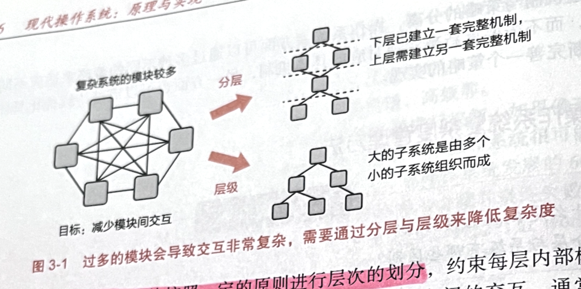
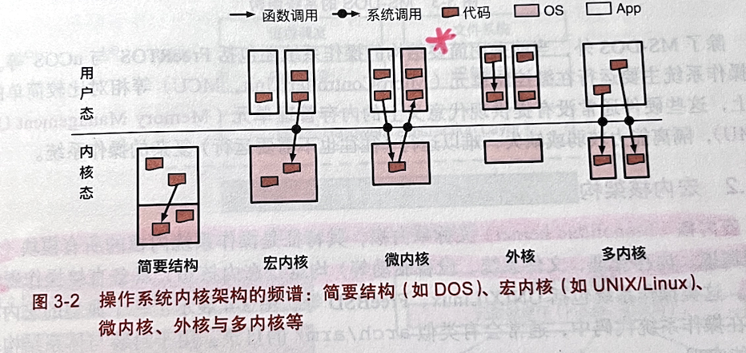
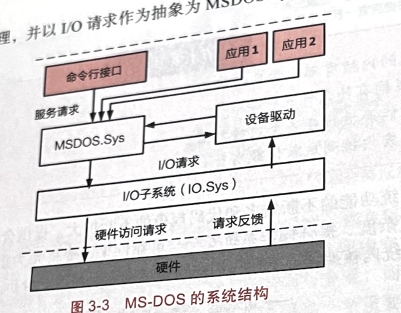
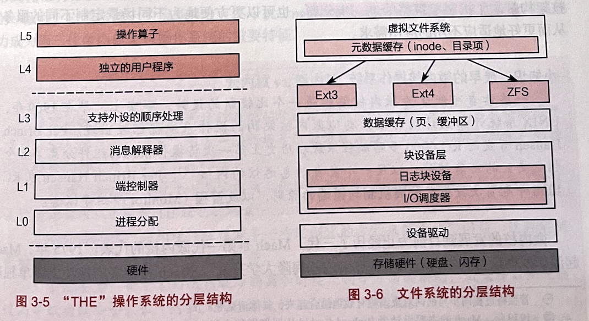
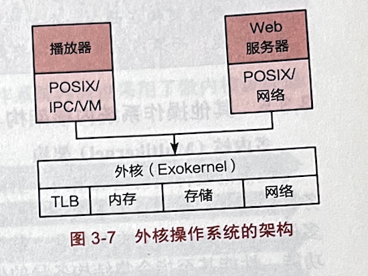
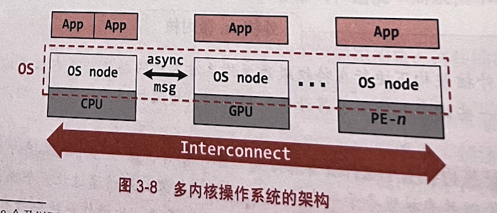
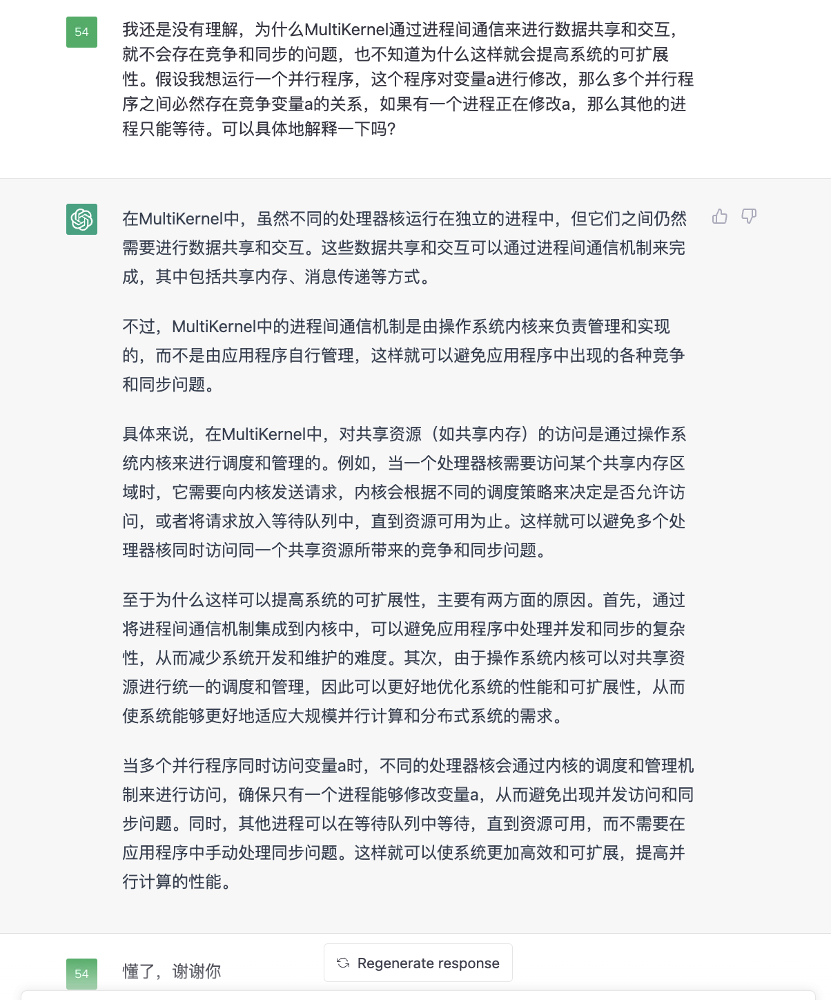
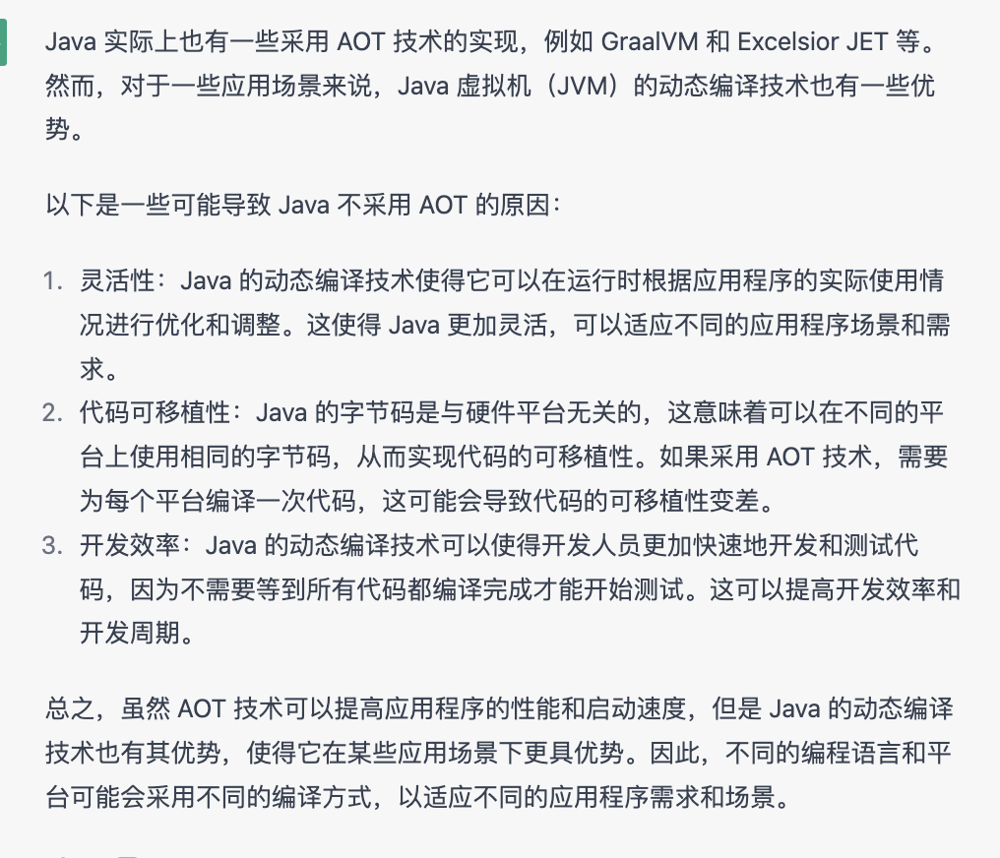
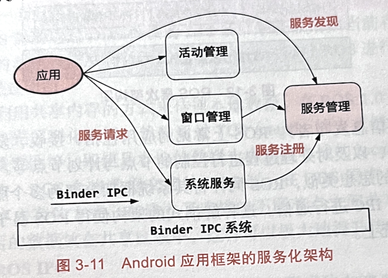
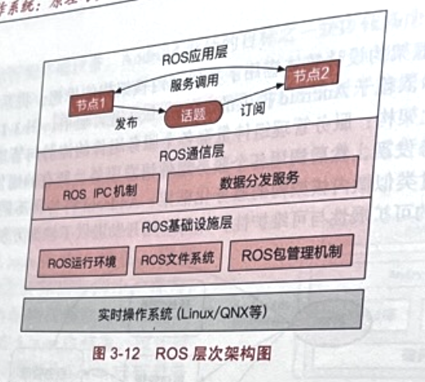

# 第3章 操作系统结构

## 操作系统的设计

为了降低操作系统设计的复杂度，需要遵循的设计原则：**策略与机制分离**。

如调度过程中：

- 策略：FCFS，RR等
- 机制：调度队列的设计、调度实体的表示、调度的中断处理等

管理复杂系统的重要方法：**M.A.L.H方法**

- 模块化 (modularity)
  - 模块的划分需要考虑高内聚和低耦合，使其具有独立性。
- 抽象 (abstraction)
  - 在模块化的基础上，将接口与内部实现分离；
  - 依从模块间的自然边界，减少模块间的交互；
    - **减少错误在模块间的传递**
    - 
  - e.g. UNIX中，只需要对独立的、连续的虚拟地址空间进行设计，应用程序无需关心物理地址的具体位置。
  - e.g. 文件系统中无需关心数据在物理介质(Flash, Disk)中的具体位置，只需要通过定义好的文件系统接口(open, read, write)操作。
    - really？
- 
- 分层 (layering)
  - 通常的原则是：一个模块只能和同层模块以及相邻的上层或下层模块进行交互.
  - 分层也是构建复杂系统的一个重要的方式：确定层级后，我们可以先构建底层的模块，然后利用底层模块提供的功能与服务进一步构建上层的模块。
- 层级 (hierachy)
  - 首先将一些功能相近的模块组成一个具有清晰接口的自包含子系统，然后再将这些子系统递归地组成一个具有清晰接口的更大子系统。

## 操作系统内核架构

### 简要结构

简要结构，将应用程序和操作系统放在同一个地址空间，无需底层硬件提供复杂的内存管理、特权级隔离等功能。

MS-DOS(MicroSoft Disk Operating System)内部结构：

- MSDOS.Sys模块：通过命令行接口与用户交互，负责与设备驱动交互以实现对硬件设备的控制
- IO.Sys：IO子系统实现对硬件设备I/O访问的管理，以I/O请求作为抽象为MSDOS.Sys和驱动设备I/O提供服务

FreeRTOS和uCOS等也采用简要结构。

- 主要运行在微控制单元(MicroController Unit, MCU)等相对简单的硬件上
  - 没有提供现代意义上的内存管理单元(Memory Management Unit)
- 隔离能力较弱或缺失

### 宏内核架构

宏内核(Monolithic Kernel)又称单内核。

特征：操作系统内核的所有模块均在内核态。具备直接操作硬件的能力。

> 模块：包括进程调度、内存管理、文件系统、设备驱动等。

UNIX/Linux, FreeBSD采用宏内核架构。

宏内核架构中的M.A.L.H:

1. 模块化
   1. UNIX/Linux, Windows内核均采用模块化
   2. 提供了可加载内核模块(Loadable Kernel Module, LKM)机制。
      1. 例如当前大部分设备驱动是以可加载模块的形式存在的，与内核其他模块解耦。
2. 抽象
   1. UNIX将文件作为一个重要的抽象,everything is a file
3. 分层
   1. 
4. 层级
   1. 调度子系统中对优先级的分类
   2. 控制组(cgroup)对进程层级的分类
   3. 内存分配器对不同内存的分类

### 微内核架构

根据Andrew Tanenbaum等人的论文中提到，一般工业界系统中每千行代码大约有6～16个缺陷。

并且，宏内核架构下，所有内核模块均运行在特权空间，一个单点错误就可能导致整个系统的崩溃。

微内核架构：内核仅保留极少的功能，为这些服务提供通信等基础功能，使其能够互相协作以完成操作系统所必须的功能。

> 最早的微内核操作系统：
>
> 1969年，Per Brinch Hansen开发的RC 4000，首次提出了分离机制与策略的原则和管程这个概念。

#### 第一代微内核

> Mach是第一代微内核的代表。
>
> 缺点：
>
> Mach对进程间通信(Inter-Process Communication, IPC)的设计过于通用
>
> Mach微内核自身资源(CPU, CPU缓存等)占用过大。

#### 第二代微内核

高性能的IPC实现。

极小化的微核。

#### 第三代微内核

#### 微内核 vs 宏内核

- 弹性扩展能力：宏内核很难通过简单的裁剪或扩展，使其支持资源诉求从KB到TB级别的场景。
- 硬件异构性：异构硬件往往需要一些定制化的方式来解决特定问题，这种定制化对于宏内核来说很难得到长期的支持。
- 功能安全：由于宏内核在故障隔离和时延控制等方面的缺陷，截至目前尚无通过高等级功能安全认证（例如，汽车行业的 ASIL-D）的先例。
- 信息安全：宏内核架构的操作系统存在较大的信息安全隐患，如内核态驱动容易造成低质量的驱动代码入侵内核，粗粒度权限管理容易带来权限漏洞。
  - 如何入侵内核？Memory Leak？
- 确定性时延：由于宏内核架构资深隔离较为困难，且各模块耦合度高导致难以控制系統调用的时延，因此较难做到确定性时延；即便为时延做一些特定优化（例如Linux-RT补丁，时延抖动仍然较大）。
- Linux近期逐步采用了一些用户态驱动模型(UIO,VFIO等)
- Andriod在Treble项目中同样将部分驱动放入了用户态，并通过名为Binder的IPC机制来与这些驱动进行互动。

---

### 外核架构

操作系统内核在硬件管理方面的两个主要功能是资源抽象与多路复用 (multiplexing)

对硬件资源抽象存在的问题：

1. 过度的硬件资源抽象可能会带来较大的性能损失，违反“抽象但不隐藏能力”(abstract but don't hide power)原则
2. 操作系统所提供的硬件资源是针对所有应用的通用抽象。这些抽象对一些具体的应用(如数据库，Web服务器等)往往不是最优选择。

在许多场景，应用比操作系统更了解应该如何去抽象和使用硬件资源。应当由应用来尽可能控制对硬件资源的抽象。

**LibOS**，将对硬件的抽象封装到LibOS中(将硬件资源的抽象模块化为一系列的库，LibOS)，与应用直接链接，降低应用开发的复杂度。

操作系统内核只负责对硬件资源在多个库操作系统之间的**多路复用**的支持，并管理这些LibOS的生命周期。

优点

> 1. 可按照应用领域的特点与需求，动态组装成最适合该应用领域的LibOS，最小化非必要的代码，从而获得更高的性能；
> 2. 处于硬件特权级的操作系统内核可以做到非常小，并且由于多个LibOS之间的强隔离性；从而可以提升整个计算机系统的安全性与可靠性。

应用

> 1. 一些功能受限、对操作系统接口要求不高但对性能和时延特别敏感的嵌入式场景。
>    1. 将数据面与控制面分离。
>    2. 数据面：（data plane）负责数据的处理与转发
>    3. 控制面：（control plane）负责设备的管理和配置
> 2. 当前云计算平台的容器（container）架构很多都采用了脱胎于外核架构的 Unikernel（本质上是一个 Libos)，通过将虚拟机监控器作为支撑 Unikernel/Libos 运行的内核，从而支持对高性能业务的独立部署。

劣势

> LibOS通常为某种应用定制，缺乏跨场景的通用性，应用生态差。
>
> - 难以用于功能要求复杂、生态和接口丰富的场景。
> - LibOS需要做得过于复杂，相当于一个完整的宏内核。
> - 丧失了外核架构带来的性能、安全优势。
> - LibOS通常会实现相同、类似的功能
> - 代码冗余
> - 因此对于资源受限的场景
>   - 通常需要一些跨地址空间的代码去重
>   - 或共享机制来减少内存开销

### 外核vs微内核

硬件资源抽象

1. 外核架构中，将多个硬件资源分为一个个切片，每个切片中保护的多个硬件资源由LibOS管理，并直接服务于一个应用。
   1. 应用：指为了完成某个功能的应用集合。
2. 微内核架构中，通过让一个操作系统模块独立运行在一个地址空间，来管理一个具体的硬件资源，微操作系统中所有的应用服务。

内核管理

1. 外核架构中，运行在特权级的内核主要为LibOS提供硬件的多路复用能力，并管理LibOS
2. 微内核架构中，内核主要提供进程间通信（IPC）功能

场景

1. 外核架构在面向一个功能与生态受限的场景时可通过定制化LibOs获得非常高的性能
2. 微内核架构则需要更复杂的优化才能获得与之类似的性能。

### 多内核架构

#### 多核与众核

一般认为8个及以下处理器核为多核，多于8个处理器核称为众核。

#### Dennard缩微定律

> 随着晶体管变得越来越小，它们的功率密度保持不变，从而使功率使用与面积成比例。
>
> 此定律已终结。why？

#### MultiKernel

- 将一个众核系统看成一个由多个独立处理器核通过网络互联而成的分布式系统。
- 与传统操作系统类似，假设硬件处理器提供全局共享内存的语义。
- 不同处理核之间的交互，提供了一层基于进程间通信的抽象。

  - 避免了处理器核之间通过共享内存进行隐式的共享。
    - 避免了传统OS中，复杂的隐式共享所带来的性能可扩展性瓶颈。
- 
- 每个CPU核上运行一个独立的OS node

  - 节点之间的交互由OS node之间的IPC完成。
  - OS node是独立的，并且可以是不同的，很容易支持异构处理器架构。
  - 但是，不同的OS node之间存在状态冗余，对资源开销会造成一定的压力。
  - 上层应用必须使用MultiKernel提供的进程间通信接口才能交互，绝对性能方面不一定存在优势，且需要移植现有应用才能适应MultiKernel架构。
    - 是否存在平滑迁移的方法？比如接受原本的接口，直接转换为MultiKernel的接口？？

### 混合内核架构

## 操作系统框架结构

### Andriod系统架构

Apache Software License，商用友好

1. 硬件抽象层
   1. 在Linux内核上提供一层硬件抽象层的原因
      1. 设备驱动运行在Linux内核态，因此设备驱动接口依赖于Linux内核设备驱动接口的演进
         1. 会阻碍安卓系统的独立演进和升级
      2. Linux内核采用GPLv2开源协议，要求运行在同一地址空间的设备驱动必须开源，这会导致一些硬件的实现细节也被公开。
   2. 硬件抽象层，封装了一些硬件的细节，解耦Linux内核和Android系统
   3. 通过提供用户态驱动模型，使得设备厂商不需要开放源码就能为Andriod操作系统提供设备驱动。
2. Android运行环境
   1. andriod主要使用java进行开发，需要一个运行时环境，将应用从字节码转化为可执行代码。
   2. 早期的Android采用 Dalvik 虚拟机的形式，通过解释执行与 JIT ( Just in-Time）编译的方式运行，因而带来一些性能与功耗的损失。
   3. 5.0后引入了ART，通过Ahead-of-Time(AOT)预先编译的方式，将java代码预编译为二进制可执行代码，从而避免运行时的编译开销。
3. Android应用架构
   1. 包括服务管理、活动管理、包管理、窗口管理等。

#### 服务化架构与Binder IPC

### ROS系统架构

Robot Operating System

基础设施层的运行环境指Python、C++等运行环境。

ROS应用层是由一个个节点构成的计算图。

#### 话题

单向的异步通信机制。

发布者在主节点注册一个话题，发布者以消息的形式发布关于该话题的新内容。

订阅者通过主节点获得对应话题的发布者发布的信息。

#### 数据分发服务

用数据分发服务(Data Distribution Service, DDS)支持实时性。

DDS被看作一个系统中间件。在ROS应用层和ROS基础设施层之间。

将DDS分离出来，是为了将对性能有重要影响的通信进行加速。

在DDS的基础上，实现一套分布式发现系统(Distributed Discovery System)，避免在主节点上出现性能瓶颈。

## 思考题

