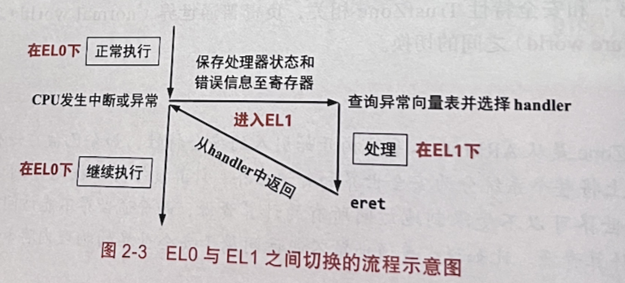
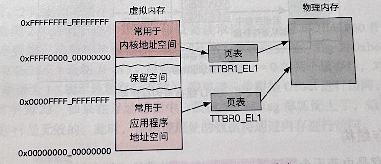
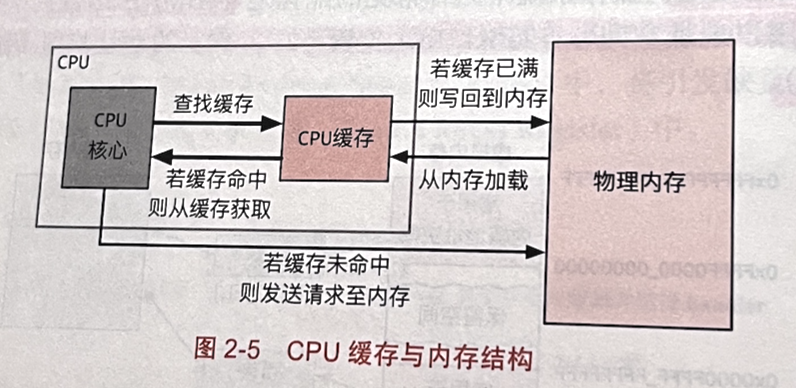
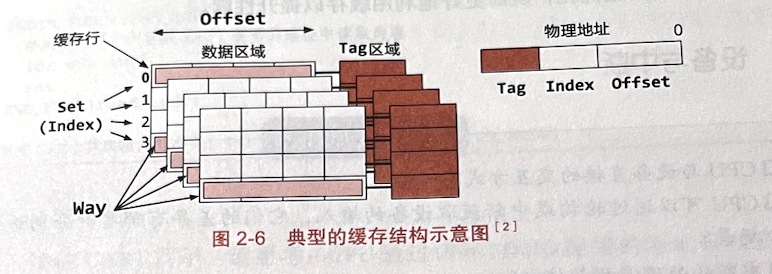
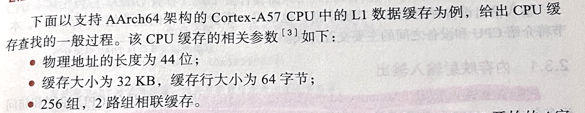
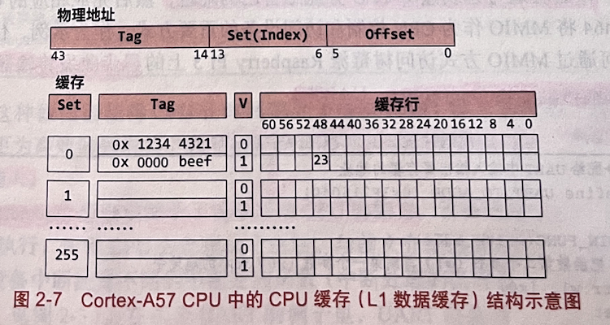
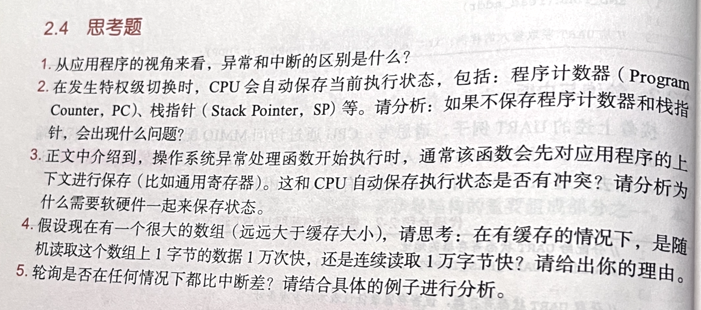

# 第2章 硬件结构

## 指令集——AArch64

AArch64 属于 RISC

AArch64 每条指令的长度固定为 4 字节，指令类型包括：

- 数据搬移指令：如 mov
- 寄存器计算指令：如 add, sub
- 内存读写指令：如内存加载 ldr, 内存写入 str
- 跳转指令：如无条件跳转 b
- 过程调用指令：调用指令 bl, 返回指令 ret
- 特权指令：读取系统寄存器指令 msr, 写入系统寄存器指令 mrs

## 特权级

AArch64的特权级被称为异常级别(Exception Level, EL)

- EL0: 用户态，最低的特权级，应用程序运行在该特权级
- EL1: 内核态，操作系统运行在该特权级
- EL2: 在虚拟化场景下需要，虚拟机监控器 (Virtual Machine Monitor, VMM, 也称为Hypervisor) 通常运行在该特权级。
- EL3: 和安全特性 Trustzone 相关，负责普通世界 (normal world) 和安全世界(secure world)之间的切换。
  - Trustzone 是从 ARMv6 体系结构开始引入的安全特性，如今已被广泛使用。该特性从逻辑上将整个系统分为安全世界和普通世界，计算资源可以被划分到这两个世界中。安全世界可以不受限制地访问所有的计算资源，而普通世界不能访问被划分到安全世界的计算资源。比如说，普通世界不能访问属于安全世界的物理内存和设备。

### EL0切换到EL1的场景

同步的 CPU 特权级切换，由 CPU 中执行的指令所导致的：

1. 应用程序需要调用操作系统提供的系统调用。svc (特权调用, supervisor call)
2. 应用程序执行的指令触发了异常 (exception)
   1. 如访存指令会出发缺页异常 (page fault)

异步的CPU特权级切换，不是由CPU执行的指令所导致的：

3. 应用程序执行的过程中，CPU收到一个来自外设的中断 (interrupt)

发生特权级切换的时刻，CPU保存当前执行状态，主要包括：

| 保存的状态                                           | 保存的位置                                                                                                                                   |
| ---------------------------------------------------- | -------------------------------------------------------------------------------------------------------------------------------------------- |
| 触发异常的指令地址(PC, Program Counter)              | ELR_EL1(异常链接寄存器, Exception Link Register)                                                                                             |
| 异常原因（即异常是由于svc指令还是由于访存缺页导致的) | ESR_EL1(异常症状寄存器, Exception Syndrome Register)                                                                                         |
| 栈指针(SP, Stack Pointer)                            | 从SP_EL0(应用程序使用的栈)切换到SP_EL1(操作系统通过这个寄存器配置异常处理过程中使用的栈)                                                     |
| CPU的相关状态                                        | SPSR_EL1(已保存的程序状态寄存器, Saved Program Status Register)<br />引发缺页异常的地址保存在FAR_EL1(错误地址寄存器, Fault Address Register) |

操作系统可以在异常向量表中为不同的异常类型配置相应的异常处理函数。因此，当发生特权级切换时，CPU 会读取 VBAR_EL1 (向量基地址寄存器，Vector Base Address Register) 来获得异常向量表 (exception vector table）的基地址，然后根据异常原因(ESR_EL1中保存的内容)调用操作系统设置的相应异常处理函数。

异常处理完成后，执行eret(异常返回，Exception Return)指令，恢复CPU自动保存的EL0状态，并切回到EL0。



## 寄存器

AArch64中，有31个64位的通用寄存器，X0～X30。

| 寄存器    |                                                         |                                                        |
| --------- | ------------------------------------------------------- | ------------------------------------------------------ |
| X29       | 帧指针(Frame Pointer, FP)寄存器                         | 保存函数调用过程中栈顶的地址                           |
| X30       | 链接指针(Link Pointer, LP)寄存器                        | CPU 在执行函数调用指令 bl 时会自动把返回地址保存在其中 |
| TTBR0_EL1 | 页表基地址寄存器(Translation Table Base Register, TTBR) | 负责翻译虚拟地址空间中不同的地址段, 通常[0, 2^48)      |
| TTBR1_EL1 | 页表基地址寄存器(Translation Table Base Register, TTBR) | 负责翻译虚拟地址空间中不同的地址段, 通常[2^48, 2^64)   |
| TCR_EL1   | 翻译控制寄存器(Translation Control Register)            | 决定页表基地址负责的地址范围                           |

Q: 一个64位的寄存器是怎么负责翻译的？



## 物理内存与CPU缓存

CPU使用物理内存的过程：

通过总线向物理内存发送一个读写请求，包括目标地址，(如果是写请求，则还包括写入值)。

物理内存收到请求后，进行读写，(如果是读请求，则返回读取值到CPU)。

**内存访问速度很慢：一次内存访问可能花费上百个时钟周期。**

**所以引入了缓存。一般最快只需要几个时钟周期**。



### 缓存结构

CPU缓存是由若干个缓存行（cache line）组成的。

缓存行常见的是 64 字节。

每个缓存行包括：

- 一个有效位(valid bit)，用于表示其是否有效；
- 一个标记地址(tag address)，用于标识其对应的物理地址；
- 一些其他的状态信息。

CPU把物理内存中的数据读到CPU缓存，以及把数据写会到物理内存，都是以缓存行(cache line, 64 bytes)为单位的。



物理地址在逻辑上分为:Tag, Set(组，也称为Index)和Offset三段。

组(Set)和路(Way)

物理地址中的Set段能表示最大数目为组。

例如，如果set段的位数是8，那么对应的 CPU 缓存的组数就是 256 （2^8=256）。

同一组（即 set 段相等）下，支持的最大Tag数则称为路，即同一组下的缓存行数目。

图2-6表示的是4路组相联(4-Way Set Associative)。

### 缓存寻址

先匹配set，再匹配tag，再看有效位





## 设备与中断

### 内存映射输入输出

内存映射输入输出 (Memory-Mapped I/O, MMIO) 是一种常见的 CPU 控制和访问设备的方式。

**MMIO**的原理是：

    把输人输出设备和物理内存放到同一个地址空间，为设备内部的内存和奇存器也分配相应的地址。

    当CPU 通过MMIO 的方式为一个设备分配了地址之后，CPU 可以使用和访问物理内存一样的指令（ldr 和str） 去读写这些属于设备的地址；设备会通过总线监听 CPU 分配给自己的地址，然后完成相应的 CPU 访问请求。

    AArch64將 MMIO 作为 CPU 控制和访问设备的重要方式。

通过 MMIO 方式访问树莓派 Raspberry Pi 3 上的异步收发传输器(Universal Asynchronous Receiver/Transmitter, UART)。

```assembly
// 分配给UART中输入输出寄存器的地址
#define UART_IO_ADDR (0x3F215040)

BEGIN_FUNC(write_addr)
    // 把函数第二个参数(w1)写到第一个参数(x0)表示的地址中
    str w1, [x0]
    ret
END_FUNC(write_addr)

// 从UART输出的样例: write_addr(UART_TO_ADDR, 'a');

BEGIN_FUNC(read_addr)
    ldr w0, [x0]
    ret
END_FUNC(read_addr)

// 从UART获取输入的样例: int a = read_addr(UART_TO_ADDR)
```

### 轮询与中断


中断机制，赋予了设备通知CPU的能力。

操作系统为不同的设备中断配置不同的中断处理函数。

与异常的处理过程类似。

中断设备的功能：

- **让设备主动通知CPU**
- **让一个CPU核心通知另一个CPU核心**

## 思考题


